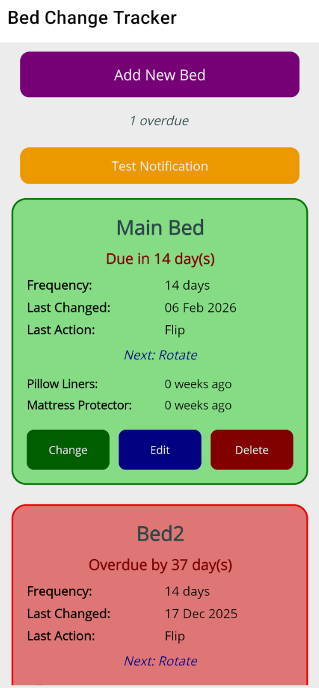

# 🛏️ BedChangeReminder

A .NET MAUI Android app to track when your beds are due for a sheet change, and optionally track mattress flipping/rotating, mattress protector changes, and pillow liner changes.

## Download

Download the latest APK from the [Releases page](https://github.com/ruahowes/BedChangeReminder/releases).

> **Note:** You will need to enable "Install from unknown sources" on your Android device.

## Features

- **Track multiple beds** — add, edit, and delete beds with custom names and change frequencies
- **Smart reminders** — colour-coded cards show overdue (red), due today (orange), due soon (gold), and up-to-date (green) status
- **Mattress flip/rotate tracking** — records whether you flipped or rotated the mattress and recommends the next action
- **Mattress protector tracking** — optionally log when the mattress protector was changed, with weeks-since-last-change summary
- **Pillow liner tracking** — optionally log when pillow liners were changed, with weeks-since-last-change summary
- **Local notifications** — scheduled reminders the day before a bed change is due (9am)
- **Pull-to-refresh** — swipe down to refresh the bed list
- **Local SQLite database** — all data stored on-device

## Screenshots

## Tech Stack

| Component | Technology |
|-----------|-----------|
| Framework | .NET 8 / .NET MAUI |
| Platform | Android (API 33+) |
| Architecture | MVVM |
| UI Toolkit | MAUI Community Toolkit |
| MVVM | CommunityToolkit.Mvvm (source generators) |
| Database | SQLite (sqlite-net-pcl) |
| Notifications | Plugin.LocalNotification |

